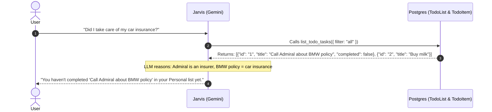

# Todo Module & Jarvis AI Integration Architecture

This document details how the **Todo Module** functions, how it is connected to the PostgreSQL database, and how the **Jarvis AI Assistant** interacts with todo items (including semantic reasoning and potential vector-based RAG search).

---

## Table of Contents

- [1. System Architecture & Database](#1-system-architecture--database)
- [2. Current REST API & Frontend Flow](#2-current-rest-api--frontend-flow)
- [3. How Jarvis Interacts with Todo Items](#3-how-jarvis-interacts-with-todo-items)
- [4. Semantic Search vs. Exact Match: Handling Indirect Queries](#4-semantic-search-vs-exact-match-handling-indirect-queries)
  - [Approach 1: LLM In-Memory Reasoning (Recommended & Active)](#approach-1-llm-in-memory-reasoning-recommended--active)
  - [Approach 2: Semantic Vector Search with `pgvector` (For High-Volume Archives)](#approach-2-semantic-vector-search-with-pgvector-for-high-volume-archives)
- [5. Recommended Jarvis Todo Toolset Expansion](#5-recommended-jarvis-todo-toolset-expansion)

---

## 1. System Architecture & Database

The Todo system is backed by PostgreSQL via **Prisma ORM** (`prisma/schema.prisma`). It consists of two relational models linked to the authenticated `User`:

```prisma
model TodoList {
  id        String     @id @default(cuid())
  userId    String
  name      String
  createdAt DateTime   @default(now())
  updatedAt DateTime   @updatedAt

  user      User       @relation(fields: [userId], references: [id], onDelete: Cascade)
  items     TodoItem[]

  @@index([userId])
  @@map("todo_lists")
}

model TodoItem {
  id        String   @id @default(cuid())
  listId    String
  userId    String
  title     String
  completed Boolean  @default(false)
  createdAt DateTime @default(now())
  updatedAt DateTime @updatedAt

  todoList  TodoList @relation(fields: [listId], references: [id], onDelete: Cascade)
  user      User     @relation(fields: [userId], references: [id], onDelete: Cascade)

  @@index([listId])
  @@index([userId])
  @@map("todo_items")
}
```

---

## 2. Current REST API & Frontend Flow

### Backend Endpoints (`/api/v1/todos`)

All endpoints are protected by JWT authentication (`authenticate(request)`):

| Endpoint | Method | Action | Source |
| :--- | :--- | :--- | :--- |
| `/api/v1/todos` | `GET` | Retrieve all lists with nested tasks for the user | `app/api/v1/todos/route.ts` |
| `/api/v1/todos` | `POST` | Create a new todo list | `app/api/v1/todos/route.ts` |
| `/api/v1/todos/[listId]` | `PATCH` | Rename a todo list | `app/api/v1/todos/[listId]/route.ts` |
| `/api/v1/todos/[listId]` | `DELETE` | Delete list and cascaded tasks | `app/api/v1/todos/[listId]/route.ts` |
| `/api/v1/todos/[listId]/items` | `POST` | Add task to a specific list | `app/api/v1/todos/[listId]/items/route.ts` |
| `/api/v1/todos/items/[itemId]` | `PATCH` | Toggle completion status or edit title | `app/api/v1/todos/items/[itemId]/route.ts` |
| `/api/v1/todos/items/[itemId]` | `DELETE` | Delete a task item | `app/api/v1/todos/items/[itemId]/route.ts` |

### Frontend UI (`app/modules/todo/page.tsx`)

- **Multi-List Sidebar**: Lists on the left with active/total task counters.
- **Optimistic Updates**: Task additions, edits, deletes, and toggles apply immediately in React state, reverting if an API error occurs.
- **Automatic Task Sinking**: Active tasks stay on top; completed tasks strike through and move to the bottom.

---

## 3. How Jarvis Interacts with Todo Items

Jarvis orchestrates actions using the **Model Context Protocol (MCP)** tool calling interface defined in `lib/skills.ts` and dispatched in `app/api/v1/jarvis/chat/route.ts`.

### Built-in Todo Tools:
1. `get_workspace_stats`: Retrieves telemetry including total todo lists and pending tasks.
2. `list_todo_tasks`: Fetches all lists and items (can filter by `all`, `active`, or `completed`).
3. `create_todo_task`: Creates a task in a designated or default list (requires user confirmation guardrail).

---

## 4. Semantic Search vs. Exact Match: Handling Indirect Queries

### The Problem
If a user saves a task titled **"Call Admiral for BMW policy"** or **"Vehicle paperwork"**, a keyword search for *"insurance"* in SQL will find nothing.

---

### Approach 1: LLM In-Memory Reasoning (Recommended & Active)

Because personal todo lists usually range from 10 to a few hundred active tasks, the system loads all active tasks into the LLM context using `list_todo_tasks`.



#### Key Advantages:
- **Zero Embedding Infrastructure**: No vector database or sync pipelines required.
- **Superior Semantic Understanding**: The LLM natively understands brands (*Admiral*, *Geico*), abbreviations (*MOT*, *BMW*), and slang.
- **Cost & Context Efficiency**: 100 tasks is ~1,000 tokens. In Gemini 2.0 Flash (1,000,000+ token context), this consumes **< 0.1%** of available context.

---

### Approach 2: Semantic Vector Search with `pgvector` (For High-Volume Archives)

If thousands of completed and archived tasks accumulate over several years, using `pgvector` directly in PostgreSQL avoids loading massive histories into context:

#### 1. Enable `pgvector` Extension
```sql
CREATE EXTENSION IF NOT EXISTS vector;
```

#### 2. Update Prisma Schema
```prisma
model TodoItem {
  id        String   @id @default(cuid())
  listId    String
  userId    String
  title     String
  completed Boolean  @default(false)
  createdAt DateTime @default(now())
  updatedAt DateTime @updatedAt
  
  // 768-dimensional embedding for Gemini text-embedding-004
  embedding Unsupported("vector(768)")?

  todoList  TodoList @relation(fields: [listId], references: [id], onDelete: Cascade)
  user      User     @relation(fields: [userId], references: [id], onDelete: Cascade)

  @@index([listId])
  @@index([userId])
  @@map("todo_items")
}
```

#### 3. Embedding Generation
On task creation or title update:
```typescript
import { GoogleGenAI } from "@google/genai";

export async function generateTaskEmbedding(text: string): Promise<number[]> {
  const ai = new GoogleGenAI({ apiKey: process.env.GEMINI_API_KEY });
  const response = await ai.models.embedContent({
    model: "text-embedding-004",
    contents: text,
  });
  return response.embedding.values;
}
```

#### 4. Cosine Similarity Tool in Jarvis
```sql
SELECT id, title, completed, list_id,
       1 - (embedding <=> $1::vector) AS similarity
FROM todo_items
WHERE user_id = $2
ORDER BY embedding <=> $1::vector
LIMIT 10;
```

---

## 5. Recommended Jarvis Todo Toolset Expansion

To provide complete control over tasks via conversation, add the following tools to `lib/skills.ts`:

### 1. `search_todo_tasks` (Structured / Keyword search)
```typescript
{
  id: "builtin-search-todos",
  name: "search_todo_tasks",
  displayName: "Search Todo Tasks",
  description: "Search tasks by keyword, list name, or completion status.",
  parameters: {
    type: "object",
    properties: {
      query: { type: "string", description: "Keyword to search in task titles." },
      completed: { type: "boolean", description: "Optional completion status filter." },
      listName: { type: "string", description: "Optional list name filter." },
    },
    required: ["query"],
  },
  type: "internal",
  config: {},
  hasSecret: false,
  requireConfirmation: false,
  enabled: true,
  isBuiltIn: true,
}
```

### 2. `update_todo_task` (Complete, uncomplete, or rename)
```typescript
{
  id: "builtin-update-todo",
  name: "update_todo_task",
  displayName: "Update Todo Task",
  description: "Mark a task as completed/uncompleted or rename its title.",
  parameters: {
    type: "object",
    properties: {
      taskId: { type: "string", description: "The ID of the task." },
      completed: { type: "boolean", description: "New completion status." },
      newTitle: { type: "string", description: "Optional updated task title." },
    },
    required: ["taskId"],
  },
  type: "internal",
  config: {},
  hasSecret: false,
  requireConfirmation: false,
  enabled: true,
  isBuiltIn: true,
}
```

### 3. `delete_todo_task` (Delete task by ID)
```typescript
{
  id: "builtin-delete-todo",
  name: "delete_todo_task",
  displayName: "Delete Todo Task",
  description: "Permanently delete a specific task by its ID.",
  parameters: {
    type: "object",
    properties: {
      taskId: { type: "string", description: "The ID of the task to delete." },
    },
    required: ["taskId"],
  },
  type: "internal",
  config: {},
  hasSecret: false,
  requireConfirmation: true,
  enabled: true,
  isBuiltIn: true,
}
```
