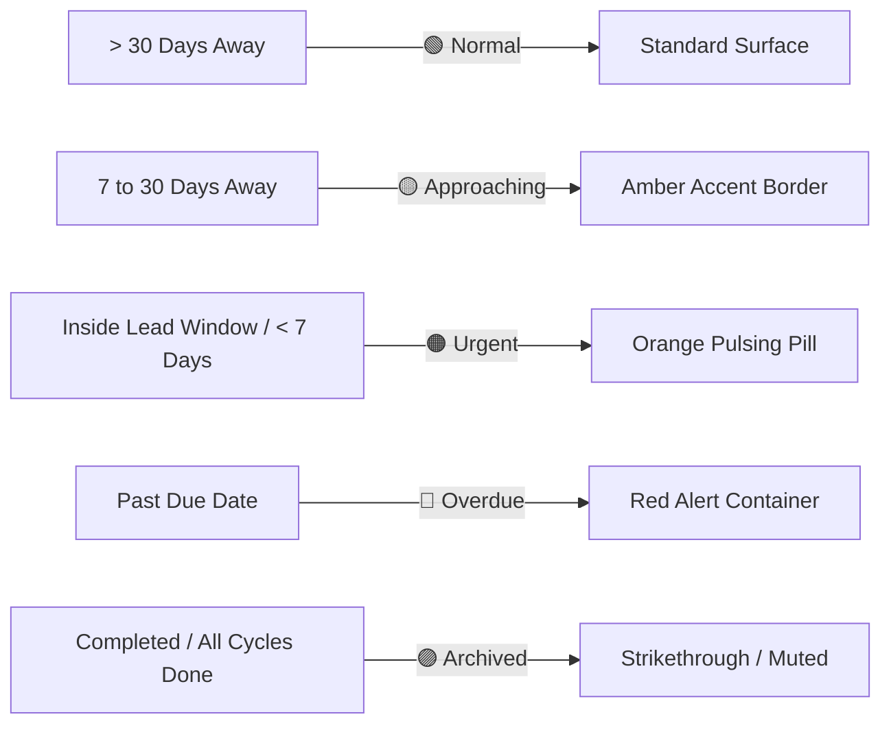
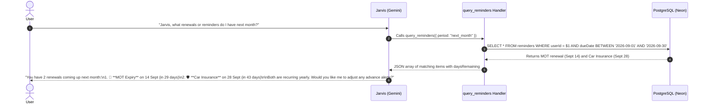

# Reminders Module & Jarvis AI Integration Specification

This document details the complete technical specification for transitioning the **Reminders Module** (`/modules/reminders`) from a preview state to an **active, standalone, database-backed module** with advanced recurrence logic, lead time alerts, and deep Jarvis AI tool calling integration.

---

## Table of Contents

- [1. Executive Overview & Objectives](#1-executive-overview--objectives)
- [2. Database Schema & Prisma Architecture](#2-database-schema--prisma-architecture)
- [3. Recurrence, Cycles & Date Arithmetic Strategy](#3-recurrence-cycles--date-arithmetic-strategy)
  - [Date Storage: Why Standard `DateTime` Wins](#date-storage-why-standard-datetime-wins)
  - [Cycle Rollover & Recurrence Engine](#cycle-rollover--recurrence-engine)
  - [Period Query Resolution (e.g. Next Month)](#period-query-resolution-eg-next-month)
- [4. Core Module Features & UI Specification](#4-core-module-features--ui-specification)
  - [A. Lead Time & Advance Notice (`leadDays`)](#a-lead-time--advance-notice-leaddays)
  - [B. 1-Click Quick Presets](#b-1-click-quick-presets)
  - [C. Visual Urgency Spectrum](#c-visual-urgency-spectrum)
  - [D. Action Controls (Acknowledge, Snooze, Edit, Delete)](#d-action-controls-acknowledge-snooze-edit-delete)
  - [E. Documents Module Linking](#e-documents-module-linking)
- [5. REST API Contract (`/api/v1/reminders`)](#5-rest-api-contract-apiv1reminders)
- [6. Jarvis AI Assistant Integration & MCP Tools](#6-jarvis-ai-assistant-integration--mcp-tools)
  - [A. MCP Tool Definitions](#a-mcp-tool-definitions)
  - [B. Execution Handlers](#b-execution-handlers)
  - [C. Conversational Flows & Sequence Diagrams](#c-conversational-flows--sequence-diagrams)

---

## 1. Executive Overview & Objectives

Currently, `/modules/reminders` runs with hardcoded preview data. This specification defines the architecture to:
1. **Promote the module to `status: "active"`** in `lib/modules.ts`.
2. **Support One-Off & Recurring Schedules**: Set frequency (daily, weekly, monthly, quarterly, yearly), interval multipliers, and cycle caps (1 for one-off, $N$ for finite recurring, or unlimited).
3. **Smart Advance Notice (`leadDays`)**: Alert users *before* the deadline (e.g., 30 days before MOT or 6 months before passport expiry).
4. **Natural Querying for Jarvis**: Enable Jarvis to answer period-based questions (e.g., *"What is due next month?"*, *"List my vehicle renewals"*, *"Give me the latest 100 reminders"*) using direct SQL date-range index scans.

---

## 2. Database Schema & Prisma Architecture

Update the `Reminder` model in `prisma/schema.prisma`:

```prisma
model Reminder {
  id              String    @id @default(cuid())
  userId          String
  title           String
  description     String?
  category        String    @default("general") // "vehicle" | "finance" | "identity" | "home" | "health" | "subscription" | "general"
  
  // Timing & Lead Notice
  dueDate         DateTime  // Target deadline / expiration date
  leadDays        Int       @default(7) // Days before dueDate to start highlighting as urgent
  
  // Recurrence Configuration
  frequency       String    @default("once") // "once" | "daily" | "weekly" | "monthly" | "quarterly" | "yearly"
  interval        Int       @default(1)      // e.g. every 2 weeks (frequency: "weekly", interval: 2)
  totalCycles     Int?      // 1 = one-off, N = finite recurrences, null or 9999 = indefinite
  completedCycles Int       @default(0)
  
  // Notification & State Tracking
  notifyBy        String    @default("email") // "email" | "push" | "webhook" | "none"
  status          String    @default("active") // "active" | "snoozed" | "completed" | "dismissed"
  snoozedUntil    DateTime?
  lastTriggeredAt DateTime?

  // Optional integration with Documents module
  documentId      String?

  createdAt       DateTime  @default(now())
  updatedAt       DateTime  @updatedAt

  user User @relation(fields: [userId], references: [id], onDelete: Cascade)

  @@index([userId, dueDate])
  @@index([userId, status])
  @@index([userId, category])
  @@map("reminders")
}
```

---

## 3. Recurrence, Cycles & Date Arithmetic Strategy

### Date Storage: Why Standard `DateTime` Wins
Storing `dueDate` as a standard ISO timestamp (`TIMESTAMPTZ` in Postgres / `DateTime` in Prisma) provides:
- **Instant Range Filtering**: Querying *"next month"* converts to `dueDate >= startOfMonth AND dueDate <= endOfMonth`.
- **Chronological Indexing**: A single B-tree index on `(userId, dueDate)` delivers $<1\text{ms}$ query times.
- **Duration Math**: Calculates days remaining (`dueDate - now()`) automatically accounting for leap years, days per month (28–31), and daylight saving time.

---

### Cycle Rollover & Recurrence Engine

When a user or Jarvis marks a recurring reminder as **"Acknowledge / Completed"**:

```typescript
export function computeNextDueDate(currentDueDate: Date, frequency: string, interval: number = 1): Date {
  const next = new Date(currentDueDate);
  switch (frequency) {
    case "daily":
      next.setDate(next.getDate() + interval);
      break;
    case "weekly":
      next.setDate(next.getDate() + 7 * interval);
      break;
    case "monthly":
      next.setMonth(next.getMonth() + interval);
      break;
    case "quarterly":
      next.setMonth(next.getMonth() + 3 * interval);
      break;
    case "yearly":
      next.setFullYear(next.getFullYear() + interval);
      break;
    default:
      break;
  }
  return next;
}
```

#### Rollover Logic on Action:
1. `completedCycles += 1`.
2. If `totalCycles !== null` and `completedCycles >= totalCycles`:
   - Mark `status = "completed"`.
3. Else:
   - Calculate `newDueDate = computeNextDueDate(dueDate, frequency, interval)`.
   - Update `dueDate = newDueDate`, `status = "active"`, and `snoozedUntil = null`.

---

### Period Query Resolution (e.g. Next Month)

Jarvis and the API can resolve natural timeframes into strict Postgres query boundaries:

| Period Expression | `fromDate` (Inclusive) | `toDate` (Inclusive) |
| :--- | :--- | :--- |
| **`today`** | Start of current day (`00:00:00`) | End of current day (`23:59:59`) |
| **`this_week`** | Start of current week (Monday) | End of current week (Sunday) |
| **`this_month`** | 1st day of current month | Last day of current month |
| **`next_month`** | 1st day of month + 1 | Last day of month + 1 |
| **`this_year`** | Jan 1 of current year | Dec 31 of current year |
| **`overdue`** | Epoch / Beginning of time | Current timestamp (`now()`) with `status: "active"` |
| **`upcoming`** | Current timestamp (`now()`) | Current timestamp + 30 days |

---

## 4. Core Module Features & UI Specification

### A. Lead Time & Advance Notice (`leadDays`)
An MOT or passport expiry reminder is ineffective on the day of expiry. Users can set a custom lead time (e.g., 30 days before). 

The UI checks if `now() >= dueDate - (leadDays * 86400000)`:
- If inside the lead window, the reminder automatically highlights with an **Approaching Warning Badge**.

---

### B. 1-Click Quick Presets

The UI provides instant setup templates:

| Preset Name | Category | Frequency | Total Cycles | Default Lead Time |
| :--- | :--- | :--- | :--- | :--- |
| 🚗 **MOT Expiry** | `vehicle` | `yearly` | Unlimited (`null`) | 30 days |
| 🛡️ **Car Insurance Renewal** | `vehicle` | `yearly` | Unlimited (`null`) | 21 days |
| 🛂 **Passport Expiry** | `identity` | `once` | 1 | 180 days (6 months) |
| 🪪 **Driving License Renewal** | `identity` | `once` | 1 | 60 days |
| 🏠 **Tenancy / Mortgage Renewal** | `home` | `yearly` | Unlimited (`null`) | 60 days |
| 🌐 **Domain & Hosting Renewal** | `subscription` | `yearly` | Unlimited (`null`) | 14 days |

---

### C. Visual Urgency Spectrum

Reminders are grouped and styled dynamically by urgency:



---

### D. Action Controls (Acknowledge, Snooze, Edit, Delete)

Each reminder card in the UI provides:
1. **Acknowledge / Mark Done**: Completes the current cycle and automatically schedules the next due date.
2. **Snooze Menu**: Dropdown to snooze by **1 day**, **3 days**, **1 week**, or **custom date**.
3. **Inline Edit**: Modify title, due date, recurrence, or notification channel.
4. **Delete**: Removes the reminder with confirmation.

---

### E. Documents Module Linking
Users can link an S3 file from `/modules/documents` (e.g., attaching `car_insurance_policy_2026.pdf` to the Car Insurance reminder) for 1-click downloads.

---

## 5. REST API Contract (`/api/v1/reminders`)

### 1. List Reminders
- **Endpoint**: `GET /api/v1/reminders`
- **Query Params**:
  - `period`: `"upcoming"` | `"this_week"` | `"this_month"` | `"next_month"` | `"this_year"` | `"overdue"` | `"all"`
  - `status`: `"active"` | `"completed"` | `"snoozed"` | `"all"` (default: `"active"`)
  - `category`: `"vehicle"` | `"finance"` | `"identity"` | `"home"` | `"subscription"` | etc.
  - `search`: Keyword string (searches `title` and `description`)
  - `limit`: Integer (default: 50, max: 100)
- **Response**:
  ```json
  {
    "reminders": [
      {
        "id": "cuid_123",
        "title": "MOT Renewal",
        "category": "vehicle",
        "dueDate": "2026-09-14T00:00:00.000Z",
        "leadDays": 30,
        "frequency": "yearly",
        "interval": 1,
        "totalCycles": null,
        "completedCycles": 2,
        "notifyBy": "email",
        "status": "active",
        "daysRemaining": 29,
        "isInsideLeadWindow": true
      }
    ],
    "count": 1
  }
  ```

---

### 2. Create Reminder
- **Endpoint**: `POST /api/v1/reminders`
- **Body**:
  ```json
  {
    "title": "Passport Renewal",
    "description": "Renew with HM Passport Office before trip",
    "category": "identity",
    "dueDate": "2027-01-02T00:00:00.000Z",
    "leadDays": 90,
    "frequency": "once",
    "interval": 1,
    "totalCycles": 1,
    "notifyBy": "email",
    "documentId": "doc_abc123"
  }
  ```

---

### 3. Update / Acknowledge / Snooze Reminder
- **Endpoint**: `PATCH /api/v1/reminders/[id]`
- **Body Options**:
  - **Acknowledge Cycle**: `{ "action": "acknowledge" }`
  - **Snooze**: `{ "action": "snooze", "snoozeDays": 3 }` or `{ "action": "snooze", "snoozedUntil": "2026-09-20T00:00:00.000Z" }`
  - **Direct Edit**: `{ "title": "...", "dueDate": "...", "frequency": "..." }`

---

### 4. Delete Reminder
- **Endpoint**: `DELETE /api/v1/reminders/[id]`
- **Response**: `{ "success": true }`

---

## 6. Jarvis AI Assistant Integration & MCP Tools

### A. MCP Tool Definitions (`lib/skills.ts`)

```typescript
// 1. Query Reminders Tool
{
  id: "builtin-query-reminders",
  name: "query_reminders",
  displayName: "Query Reminders",
  description: "Search and filter user reminders by timeframe (this_week, next_month, upcoming, overdue), category, keyword, or limit.",
  parameters: {
    type: "object",
    properties: {
      period: {
        type: "string",
        enum: ["upcoming", "this_week", "this_month", "next_month", "this_year", "overdue", "all"],
        description: "Timeframe to filter reminders.",
      },
      category: {
        type: "string",
        enum: ["vehicle", "finance", "identity", "home", "subscription", "health", "general"],
        description: "Optional category filter.",
      },
      query: {
        type: "string",
        description: "Search keyword matching title or description.",
      },
      limit: {
        type: "number",
        description: "Maximum number of items to return (default 50).",
      },
    },
  },
  type: "internal",
  config: {},
  hasSecret: false,
  requireConfirmation: false,
  enabled: true,
  isBuiltIn: true,
},

// 2. Create Reminder Tool
{
  id: "builtin-create-reminder",
  name: "create_reminder",
  displayName: "Create Reminder",
  description: "Schedule a one-off or recurring reminder with custom lead time and notification channels.",
  parameters: {
    type: "object",
    properties: {
      title: { type: "string", description: "Title of the reminder." },
      dueDate: { type: "string", description: "Target ISO due date (YYYY-MM-DD or full timestamp)." },
      category: { type: "string", enum: ["vehicle", "finance", "identity", "home", "subscription", "health", "general"] },
      frequency: { type: "string", enum: ["once", "daily", "weekly", "monthly", "quarterly", "yearly"] },
      interval: { type: "number", description: "Interval multiplier (e.g. 2 for every 2 weeks). Default 1." },
      totalCycles: { type: "number", description: "Number of cycles (1 for one-off, null for unlimited)." },
      leadDays: { type: "number", description: "Advance notification days. Default 7." },
      notifyBy: { type: "string", enum: ["email", "push", "webhook", "none"] },
    },
    required: ["title", "dueDate"],
  },
  type: "internal",
  config: {},
  hasSecret: false,
  requireConfirmation: true, // Guardrail for creating reminders
  enabled: true,
  isBuiltIn: true,
},

// 3. Manage Reminder Action Tool
{
  id: "builtin-manage-reminder",
  name: "manage_reminder",
  displayName: "Manage Reminder",
  description: "Acknowledge/complete a cycle, snooze, or delete an existing reminder.",
  parameters: {
    type: "object",
    properties: {
      reminderId: { type: "string", description: "ID of the target reminder." },
      action: { type: "string", enum: ["acknowledge", "snooze", "delete"] },
      snoozeDays: { type: "number", description: "Number of days to snooze (if action is snooze)." },
    },
    required: ["reminderId", "action"],
  },
  type: "internal",
  config: {},
  hasSecret: false,
  requireConfirmation: false,
  enabled: true,
  isBuiltIn: true,
}
```

---

### B. Execution Handlers

In `lib/skills.ts`, the `query_reminders` handler processes dates effortlessly:

```typescript
case "query_reminders": {
  const { period = "upcoming", category, query, limit = 50 } = args;
  
  const now = new Date();
  const where: any = { userId, status: { not: "dismissed" } };

  if (category) where.category = category;
  if (query) where.title = { contains: query, mode: "insensitive" };

  // Period Date Range Calculation
  if (period === "this_week") {
    const start = new Date(now); start.setDate(now.getDate() - now.getDay() + 1); start.setHours(0,0,0,0);
    const end = new Date(start); end.setDate(start.getDate() + 6); end.setHours(23,59,59,999);
    where.dueDate = { gte: start, lte: end };
  } else if (period === "this_month") {
    const start = new Date(now.getFullYear(), now.getMonth(), 1);
    const end = new Date(now.getFullYear(), now.getMonth() + 1, 0, 23, 59, 59, 999);
    where.dueDate = { gte: start, lte: end };
  } else if (period === "next_month") {
    const start = new Date(now.getFullYear(), now.getMonth() + 1, 1);
    const end = new Date(now.getFullYear(), now.getMonth() + 2, 0, 23, 59, 59, 999);
    where.dueDate = { gte: start, lte: end };
  } else if (period === "overdue") {
    where.dueDate = { lt: now };
    where.status = "active";
  } else if (period === "upcoming") {
    where.dueDate = { gte: now };
  }

  const reminders = await db.reminder.findMany({
    where,
    orderBy: { dueDate: "asc" },
    take: Math.min(limit, 100),
  });

  return reminders.map((r) => {
    const daysLeft = Math.ceil((r.dueDate.getTime() - now.getTime()) / (1000 * 60 * 60 * 24));
    return {
      id: r.id,
      title: r.title,
      category: r.category,
      dueDate: r.dueDate.toISOString().split("T")[0],
      daysRemaining: daysLeft,
      frequency: r.frequency,
      leadDays: r.leadDays,
      status: r.status,
    };
  });
}
```

---

### C. Conversational Flows & Sequence Diagrams


